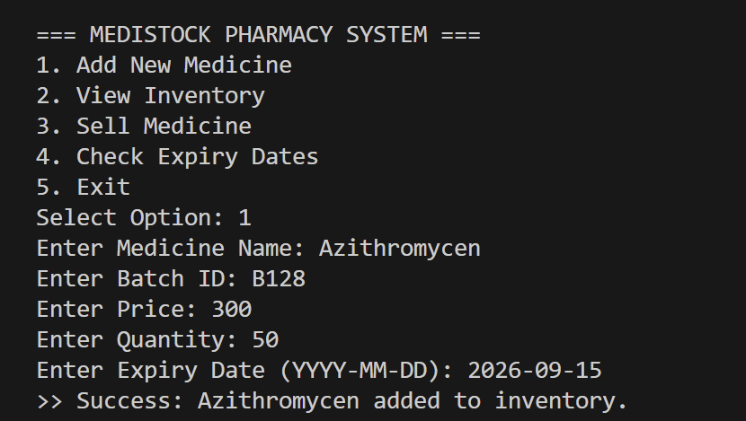
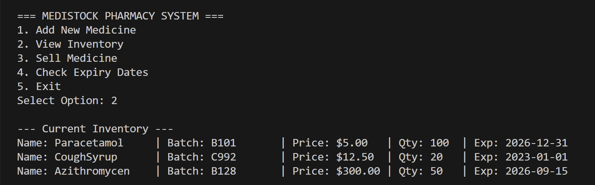
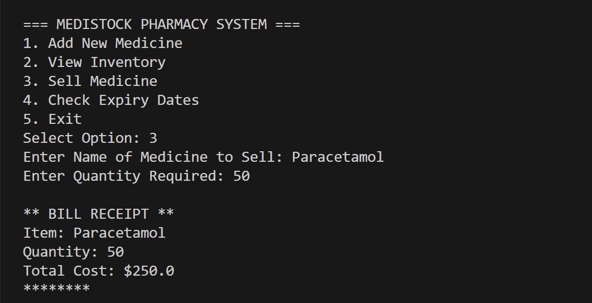
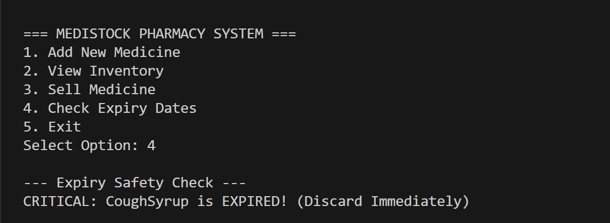
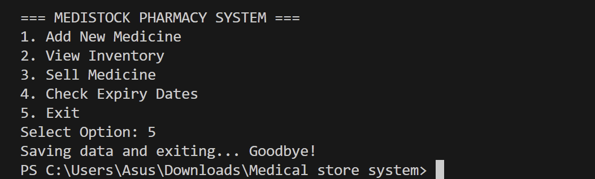

# MediStock Inventory Management System

A simple **Java console-based application** for managing medical store inventory.  
This system allows adding medicines, updating stock, deleting items, viewing expired products, and searching the inventory.

---

## 📌 Features

## 📸 Application Screenshots

Below are the main screenshots of the MediStock Pharmacy System.

### 🖼️ 1. Add New Medicine

### 🖼️ 2. View Inventory

### 🖼️ 3. Sell Medicine

### 🖼️ 4. Check Expiry Dates

### 🖼️ 5. Exit & Save Message

### ✔ Add New Medicine  
- Name  
- Batch Number  
- Price  
- Quantity  
- Expiry Date  

### ✔ View All Medicines  
Displays all medicines currently in stock.

### ✔ Search Medicine  
Search by **medicine name**.

### ✔ Update Quantity  
Increase or decrease available stock.

### ✔ Delete Medicine  
Remove a medicine using its batch number.

### ✔ View Expired Medicines  
Shows medicines whose expiry date is past the current date.

---
